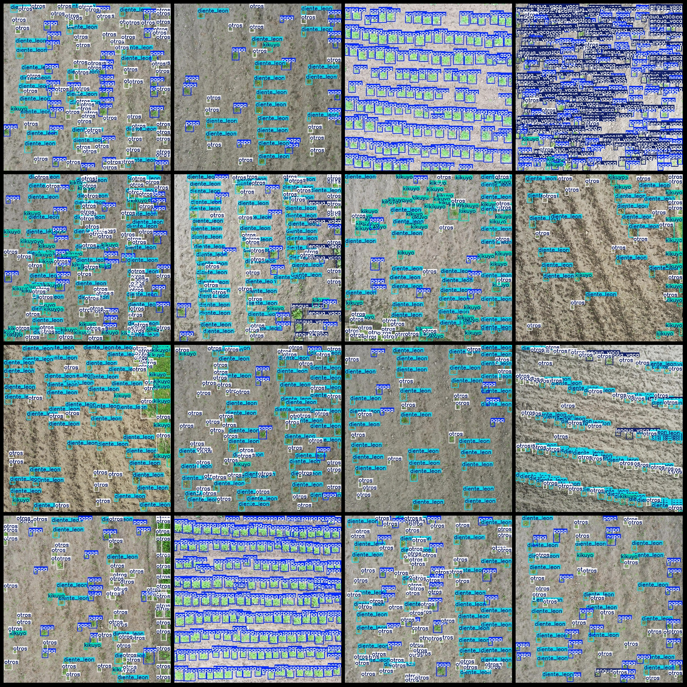
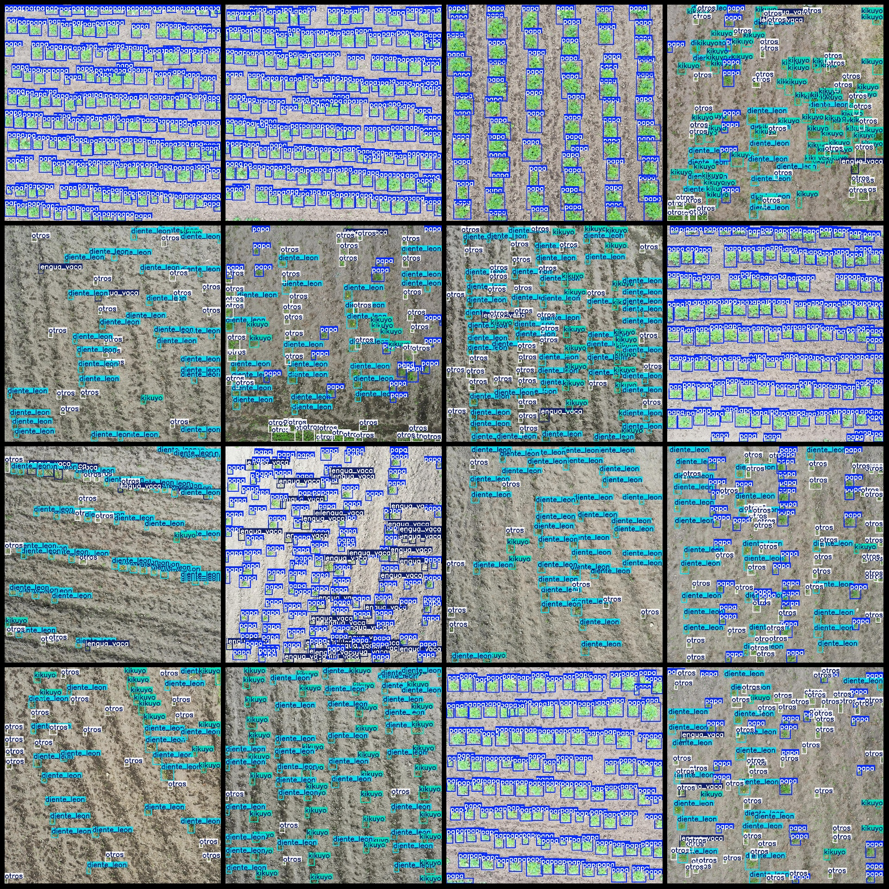

# UAV Field Potato and Weed Detection Dataset in VOC+YOLO format with 384 images across 5 classes

Dataset format: Pascal VOC format + YOLO format (txt file without split path, only contain jpg images and corresponding VOC format xml files and YOLO format txt files)
The number of images (number of jpg files): 384
Number of annotations (xml files): 384  
Number of annotations (txt files): 384  
Number of annotation categories: 5  
Number of annotation category names (notice the order in yolo format is not the same as this, and is based on the classes.txt in the labels folder): ["diente_leon", "kikuyo", "lengua_vaca", "otros", "papa"]
The number of boxes labeled in each category:
dientel_leon (dandelion) frame count = 8041
kikuyo (kukuiweed) frame count = 4229
The number of frames for "lengua vaca" (snow-white) is 5872.
The number of other boxes is 8027.
Papa = 18667
The total number of frames is 44836.
Each category has 249 images:
- diente_leon (dandelion) 249 images
- kikuyo (kukui) 221 images
- lengua_vaca (tongue grass) 208 images
- otros (other) 264 images
- papa (potato) 285 images
Image resolution: 1920x1920
Labeling tool used: labelImg
Labeling rules: Rectangle boxes are drawn around the categories.
Important note: The dataset does not have a separate training, validation, or test split; you will need to create your own.
Special declaration: This dataset does not guarantee the accuracy of the trained models or weight files.
Image preview:
## Images

Here is a pay link on Stripe ( https://buy.stripe.com/3cs8yP7sY87d0vu9AB ). Please contact me lonlonago@foxmail.com after funding $89, and I will send you a complete data files , thank you!

